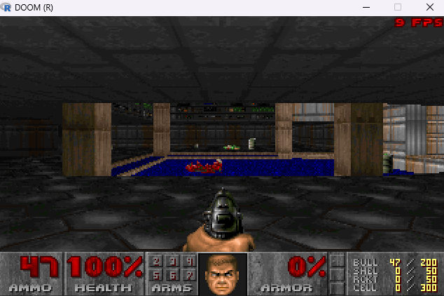

# r_doom



**Vídeo:** [DOOM rodando em R](https://youtu.be/hEJqkEXS944)

DOOM generic portado de **[python_doom](https://github.com/vagucs/python_doom)** para **R 4.6 + SDL2**.

Por **Wagner Nunes da Silva**

- vagucs@bol.com.br
- vagucs@vagucs.com.br
- vagucs@gmail.com
- [www.vagucs.com.br](https://www.vagucs.com.br)
- [LinkedIn](https://www.linkedin.com/in/wagner-nunes-da-silva-b0a15360)

Esta árvore é aquele motor em Python, de novo, em R. O laço, o mapa e o renderer ficam em R. Uma ponte pequena em C (`src/rdoom_sdl.c`) abre a janela, expande a PLAYPAL, lê o teclado, enfileira o som e, com `-crt`, desenha o tubo.

English version: [README.md](README.md)

---

## O que é este projeto

O `python_doom` é um motor de DOOM condensado e jogável, em Python. Este diretório é o **mesmo material de estudo**, reescrito em R:

- Janela, teclas, PCM: **SDL2**, chamado do R com `.Call`
- Framebuffer: 320×200, um índice da PLAYPAL por byte (`raw`), esticado para uma janela de 640×400
- Tic do jogo: 35 Hz (`TICRATE`). Cada quadro desenhado roda até 4 tics
- Renderer: BSP, visplanes, colunas, spans, sprites, o sprite da arma
- Mapa: VERTEXES, LINEDEFS, SIDEDEFS, SECTORS, SEGS, SSECTORS, NODES, THINGS, BLOCKMAP, REJECT
- Jogo: andar, portas, plataformas, interruptores, saída, itens, armas (punho, motosserra, pistola, shotgun, chaingun, foguete, plasma, BFG), barra de status, automapa no Tab, som DS*, música MUS→MIDI, menu ESC, ajuda no F1, totalização no intermission, tela derretendo na troca de fase, inimigos em look/chase/ataque

É necessário um IWAD legal (shareware `doom1.wad` ou comercial `doom.wad` / `doom2.wad`). Este repositório não distribui WAD comercial.

É um **port educacional condensado**: o motor é R, a camada nativa é só a ponte SDL.

O que fica de fora:

- Rede, joystick, mouse para olhar
- Demo, gravação e `-timedemo`
- Quantização de paleta (`-colors`, `-shades`, `-gray`, `-neogeo`)
- Arquivo de save em disco (F2 / F3 abrem as telas de salvar e carregar)

---

## Proposta educacional

Este projeto é um **material de estudo**. O port Python já tinha deixado o pré-processador e os arrays 1-based do Harbour. O port R faz outra pergunta: **o que quebra quando a linguagem é um runtime de estatística**, com vetores 1-based, inteiros de 32 bits com sinal e listas que copiam ao modificar.

O que o port pretende ensinar:

- **Python, depois R.** Abra `python_doom/doom/` ao lado de `r_doom/R/`. Os nomes ficam próximos (`thrust`, `fixed_mul`, `line_attack`) para os dois arquivos ficarem lado a lado.
- **Estouro de 32 bits, escrito por extenso.** O inteiro do R para em 2^31−1. Ângulos e ponto fixo ficam em double. `as_u32` / `as_i32` devolvem o estouro do DOOM.
- **Referência contra cópia.** Um mobj é um `environment`, então o míssil e o blockmap apontam para o mesmo objeto. Uma `list` passada a uma função é uma cópia.
- **Onde o R basta.** Colunas, chão, sprites e thinkers rodam em R. O SDL2 é a janela, o teclado, a fila de PCM e o CRT na hora de apresentar.

Sugestão de roteiro:

1. Rode `doom.bat` e leia `main.R` e `R/game.R` — boot, tic, input.
2. Compare `R/compat.R` com `python_doom/doom/compat.py`.
3. Abra `R/render.R` ao lado de `python_doom/doom/render.py`.
4. Siga uma porta a partir do **Espaço** (`use_lines` em `R/collision.R`) até `R/specials.R`.
5. Siga um tiro a partir do **Ctrl** em `R/player.R` até `spawn_player_missile` em `R/enemy.R`.

---

## De Python para R

Listas em Python são 0-based. Vetores em R são 1-based. Lumps do WAD, nós da BSP, linhas do menu e faixas de clip continuam 0-based nos dados e são lidos com `+ 1`.

| Python (`python_doom`) | R (`r_doom`) |
| --- | --- |
| `thing.x` | `thing$x` |
| `None` | `NULL` |
| `items[0]` | `items[[1]]` |
| classe / dict | `environment` (referência compartilhada) |
| `int` sem limite | `numeric`; `as_u32` / `as_i32` estouram em 32 bits |
| `&`, `\|`, `^` | `bitwAnd` / `bitwOr` / `bitwXor` abaixo de 2^31; `u32_and` acima disso |
| `x >> n` | `u32_shr` / `shar` |
| `fixed_mul` / `fixed_div` | `fixed_mul` / `fixed_div` |
| framebuffer `bytearray` | vetor `raw`, um índice de paleta por pixel |
| pygame | SDL2 via `.Call` |
| `slot[i] = None` | `x[[i]] <- NULL` **apaga** a posição; `x[i] <- list(NULL)` guarda `NULL` |
| `a * b // c` | `(a * b) %/% c` — `%/%` prende mais forte que `*` |
| um campo chamado `next` | `nxt` — `$next` não compila |

`identical(5, 5L)` é falso. Compare um número do DOOM com `==`, ou aceite o double e o inteiro. As letras de quadro do sprite usam `utf8ToInt`, porque a ordem de string no R segue o locale.

### Lado a lado: `P_Thrust`

Python (`doom/player.py`):

```python
def thrust(mo, angle, move):
    mo.momx += fixed_mul(move, fine_cos(angle))
    mo.momy += fixed_mul(move, fine_sin(angle))
```

R (`R/player.R`):

```r
thrust <- function(mo, angle, move) {
  mo$momx <- mo$momx + fixed_mul(move, fine_cos(angle))
  mo$momy <- mo$momy + fixed_mul(move, fine_sin(angle))
}
```

`.` vira `$`. `mo` é um environment, então o impulso novo fica no mobj que quem chamou já tem.

---

## Tecnologia

| Camada | Este port | Python (`python_doom`) |
| --- | --- | --- |
| Linguagem | R 4.6 (o caminho do `doom.bat` é `C:\Program Files\R\R-4.6.1\bin`) | Python 3.10+ |
| Janela, teclas, mixer | SDL2, `.Call` em `rdoom_sdl.dll` | pygame 2.x |
| Blit da paleta / CRT | C em `src/rdoom_sdl.c` | numpy |
| IWAD | os mesmos lumps | os mesmos lumps |
| Build | `doom.bat` compila a ponte e chama o `Rscript` | `pip install -r requirements.txt` |

O renderer é R. Recompilar só entra quando muda algo em `src/`.

---

## Como rodar

Neste diretório, no Windows:

```
doom.bat
doom.bat -iwad DOOM1.WAD
doom.bat -iwad ..\DOOM1.WAD -fps
doom.bat -crt
doom.bat -file extra.wad
```

O `doom.bat` gera `bin/rdoom_sdl.dll`, copia `bin/SDL2.dll` e abre `main.R`. A janela nasce em 640×400. Sem `-crt`, a textura de 320×200 é esticada em nearest-neighbor. Não há VSync.

`make run` faz o mesmo build e depois `Rscript --vanilla main.R`.

Sem `-iwad`, a busca olha `doom1.wad` / `DOOM1.WAD` / `doom.wad` / `doom2.wad` no diretório atual, no pai, no avô, em `DOOMWADDIR` e em `DOOMWADPATH`.

A ponte espera o SDL2 no layout do Rtools / MSYS usado pelo `build_sdl.bat`: headers na árvore `include\SDL2` do Rtools, a lib `libSDL2.dll.a`, e `SDL2.dll` copiada para `bin/`.

---

## Teclas

Controles clássicos do DOOM. O movimento usa **somente as setas**, para as letras ficarem livres para os cheats.

### Movimento e ações

| Tecla | Ação |
| --- | --- |
| Setas | Frente, trás, girar |
| **Shift** | Correr |
| **Alt** | Strafe (segurar) |
| **,** / **.** | Strafe esquerda / direita |
| **Ctrl** | Atirar |
| **Espaço** / **E** | Usar / abrir porta |
| **1** | Punho / motosserra |
| **2**–**7** | Pistola, shotgun, chaingun, foguete, plasma, BFG |
| **Enter** | No título, abre o menu |
| **Esc** | Menu |
| **F1** | Ajuda (`HELP2` quando o WAD tem) |
| **F2** / **F3** | Tela de salvar / tela de carregar |
| **Tab** | Abre e fecha o automapa. **F** segue o jogador, **G** liga a grade, setas deslocam o mapa com o follow desligado |
| **-** / **=** | Zoom do automapa quando ele está aberto; senão, vista 3D menor / maior |
| **Alt+Enter** | Tela cheia |

**Screen Size** e **Graphic Detail** (HIGH/LOW), no menu de opções, mudam a vista 3D. LOW desenha metade das colunas e duplica cada uma. A arma fica no centro.

No título, **Esc** ou **Enter** abre o menu. Setas e **Enter** escolhem. **Backspace** volta. **Y** confirma sair.

### Cheats

Digite durante a fase, com o menu fechado. Sem Enter. No skill Nightmare só **IDCLEV** e **IDDT** são aceitos.

| Código | Efeito |
| --- | --- |
| **IDDQD** | Modo Deus |
| **IDKFA** | Todas as armas, munição, chaves e armadura |
| **IDFA** | Armas, munição e armadura |
| **IDCLIP** / **IDSPISPOPD** | Sem colisão |
| **IDDT** | Com o automapa aberto: todas as paredes, depois os things, depois volta |
| **IDBEHOLD** | Lista os power-ups; em seguida **V** **S** **I** **R** **A** **L** |
| **IDCHOPPERS** | Motosserra |
| **IDMYPOS** | Coordenadas e ângulo |
| **IDCLEV** + 2 dígitos | Warp (`11` = E1M1, ou MAP11 num IWAD comercial) |
| **IDMUS** + 2 dígitos | Troca a música |

As mensagens na tela são ASCII, para a fonte do status conseguir desenhá-las.

---

## Parâmetros de linha de comando

### IWAD

| Parâmetro | Descrição |
| --- | --- |
| `-iwad arquivo.wad` | IWAD a carregar |
| `arquivo.wad` | Mesmo efeito, sem `-iwad` |
| `-file wad [wad…]` | PWADs extras depois do IWAD |

### Vídeo

| Parâmetro | Descrição |
| --- | --- |
| `-crt` | Tubo de CRT: curvatura, vinheta, desfoque horizontal, máscara de fósforo. Desenhado na ponte C, no tamanho da janela |
| `-fps` | Quadros por segundo no canto superior direito. Conta as vistas apresentadas, não o tic de 35 Hz |

Skill, episódio e mapa saem do menu. Trocar de fase derrete a tela. Começar um jogo novo a partir do título não derrete.

---

## Estrutura

```
main.R               entrada: Rscript --vanilla main.R
doom.bat             compila a ponte e roda
build_sdl.bat        gcc → bin/rdoom_sdl.dll + bin/SDL2.dll
Makefile             make sdl / make run
src/rdoom_sdl.c      ponte SDL2
R/                   motor
```

| Caminho | Python |
| --- | --- |
| `R/compat.R` | `doom/compat.py` |
| `R/wad.R` | `doom/wad.py` |
| `R/video.R` | `doom/video.py` (o lado R da ponte) |
| `R/v_video.R` | `doom/v_video.py` |
| `R/tables.R` | `doom/tables.py` |
| `R/r_data.R` | `doom/r_data.py` |
| `R/render.R` | `doom/render.py` |
| `R/p_setup.R` | `doom/world.py` |
| `R/collision.R` | `doom/collision.py` |
| `R/player.R` | `doom/player.py` |
| `R/specials.R` | `doom/specials.py` |
| `R/info_states.R` | tabela de estados de `doom/info.py` |
| `R/sprites.R` | `doom/sprites.py` |
| `R/enemy.R` | `doom/enemy.py` |
| `R/status.R` | `doom/status.py` |
| `R/sound.R` | `doom/sound.py` + `doom/mus2mid.py` |
| `R/menu.R` | `doom/menu.py` |
| `R/wi.R` | `doom/wi_stuff.py` |
| `R/wipe.R` | `doom/wipe.py` |
| `R/cheats.R` | máquina de cheats em `doom/game.py` |
| `R/am_map.R` | `doom/am_map.py` |
| `R/game.R` | `doom/game.py` |
| `src/rdoom_sdl.c` | janela, blit, mixer e o CRT do pygame |

---

## Linhagem

1. **[python_doom](https://github.com/vagucs/python_doom)** — Python + pygame
2. **[r_doom](https://github.com/vagucs/r_doom)** — R + SDL2 (esta árvore)

---

## Doe

### Patrocínio no GitHub

[github.com/sponsors/vagucs](https://github.com/sponsors/vagucs)

### Ethereum

`0x1b64038A2b1DB73ABd0068d8B9B0d1dC5a90C5F1`

### PIX

Chave: `vagucs@bol.com.br`
